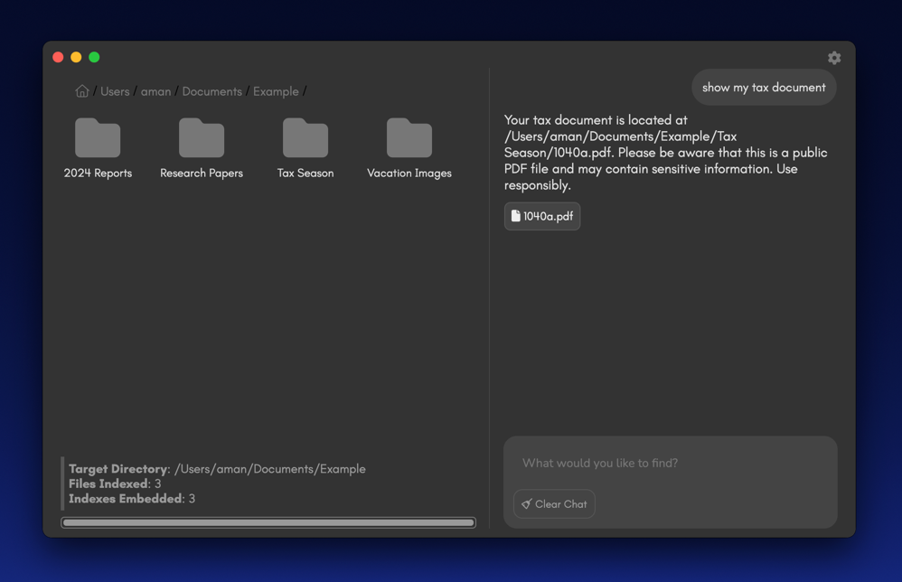
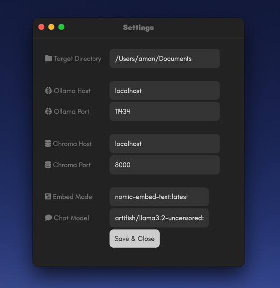

# Dora

Local drive, AI assisted deep search.




## About
Dora is a local search tool that allows you to search files on your local drive using natural language.

## Installation

### Pull Repo
```bash
git clone https://github.com/space0blaster/dora.git
cd dora
```

### With Docker
I have provided a `compose.yaml` file so you have everything you need (services) to run Dora.
The `compose.yaml` file includes Ollama and ChromaDB, that's all you need for Dora search.

There is a start script called `start.sh`. This script is contains all the steps you need to run the `compose.yaml` and the electron app.
The `start.sh` will do the following:
1. Spin up images with the `compose.yaml` file.
2. Pull the default models `nomic-embed-text` for embeddings and `artifish/llama3.2-uncensored` for chat search.
3. Install the Electron app dependencies.
4. Run the Electron app.

**Important**: If you already have Ollama and/or ChromaDB running, please spin them down first. If not, the ports will have conflicts and it will not work. If you'd rather use your existing Ollama and/or ChromaDB services, see the Without Docker section below.

To run the `start.sh` script:
```bash
sh start.sh
```


### Without Docker
Assuming you already have Ollama and ChromaDB installed and running, you can simply just run the below commands to run the electron app by itself.
Please note, if you already have Ollama, be sure to pull `nomic-embed-text` and `artifish/llama3.2-uncensored` as they are used. If you'd like, you can run your own choice of embedding and chat models. Configure your config/settings modal with your models.
Dora defaults to the default ports for both Ollama and ChromaDB, `14434` and `8000` respectively, and will point to `localhost` as a base host for both.

To run the electron app:
```bash
npm install
npm start
```

---

### Initialization
When the program runs initially, it will pop-up the Settings modal. Below are the fields:



1. `Target Directory`: This is the base directory which will be the starting point for the crawler/indexing function. Default is your base user directory See note no. 1.
2. `Ollama Host`: The host where Ollama is located. Default is `localhost`.
3. `Ollama Port`: The port for Ollama. Default is `11434` which is the default Ollama port.
4. `Chroma Host`: The host where ChromaDB is located. Default is `8000` which is the default ChromaDB port.
5. `Embed Model`: The model used specifically to create embeddings. Default is `nomic-embed-text` and it will be automatically pulled if you use `start.sh` to install and Dora.
6. `Chat Model`: The model used for chat search. Default is `antifish/llama3.2-uncensored` and it will be pulled automatically if you use `start.sh` to install and run Dora.

Click the Save button and you're ready to go.

### Changing Target Directory
To change your `Target Directory`, which is where the program starts to crawl recursively, simple click on the gear icon on top right corner and enter whatever directory you want.
This will reset the crawler and embed function.
Use absolute paths.

---

### Packaging The App
You can package the app for yourself as an application so you have an executable. Please note, if you do this, you'll still have to run the Docker images for the services for the executable to work.

To package the app:
```bash
npm run make
```

This will output your executable to a new sub folder in the `dora` directory located in `dora/out` and then the folder specific to your system architecture.

---


## Notes
1. If you have a lot of files here, I recommend pointing it to something less dense so you can try Dora out first without the crawler running for a long time; you can change this later.

* Allow the model to warm up on the first chat request. Especially if you're running this on a relatively weak machine.
* Dora will create an application folder call `.dora` in your base user directory where it will store the above-mentioned configs, chat log and the indexed files.
* I am using [artifish/llama3.2-uncensored](https://ollama.com/artifish/llama3.2-uncensored) because asking some models for private files freaks them out.
* You can try and use other uncensored models, I picked this one because it's relatively small and does well locally.
* You can also change your embedding model, the default `nomic-embed-text` does the job fine though. You can just use the embedding models that come with ChromaDB, just make sure you specify each time you embed and query.

## Roadmap
* File content embedding
  * Plaintext
  * PDFs 
  * Multimodal (images)

## License
MIT

## Contact
You can reach me on Twitter/X [here](https://x.com/amantsegai).
